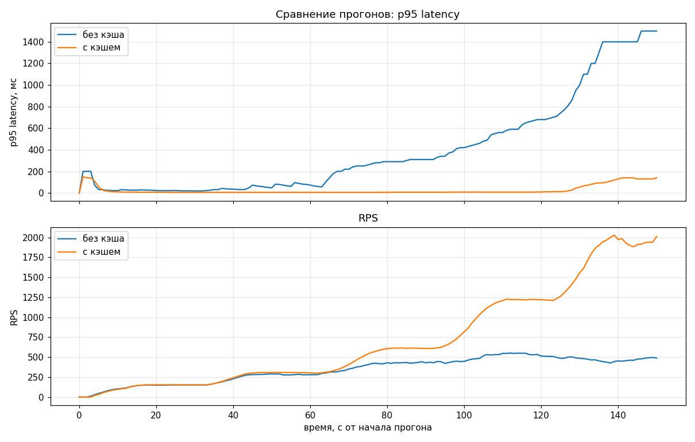
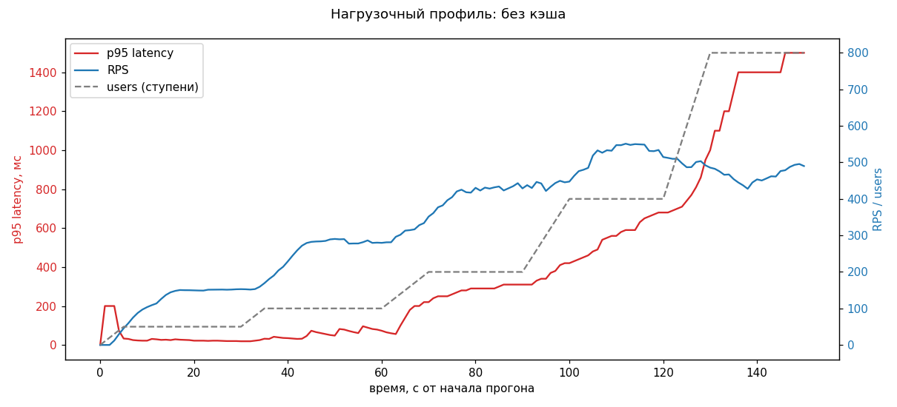
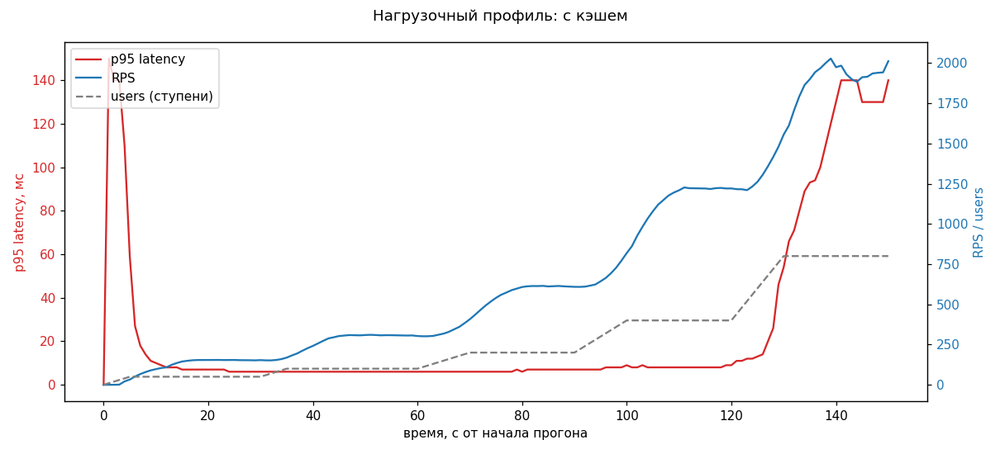
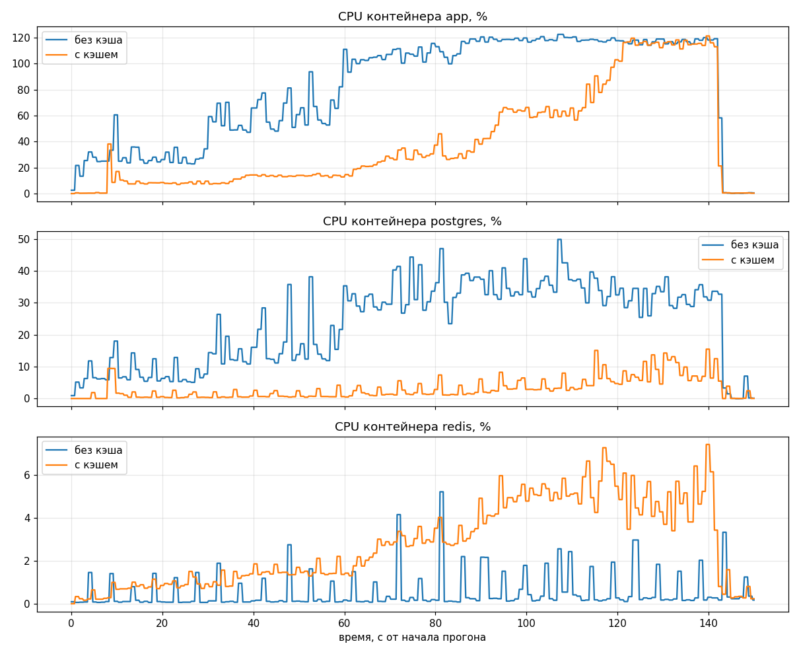

# shortist

[](https://github.com/mikhio/shortist/actions/workflows/tests.yml)
[](https://mikhio.github.io/shortist/htmlcov/index.html)
[](https://www.python.org/downloads/)
[](https://mikhio.github.io/shortist/)

> **Артефакты:**
> [coverage-отчёт](https://mikhio.github.io/shortist/htmlcov/index.html) ·
> [Locust без кэша](https://mikhio.github.io/shortist/reports/baseline/locust.html) ·
> [Locust с кэшем](https://mikhio.github.io/shortist/reports/cached/locust.html) ·
> [сводная страница](https://mikhio.github.io/shortist/)

API-сервис сокращения ссылок на FastAPI + PostgreSQL + Redis. Этот форк
проекта [`neteplo/shortist`](https://github.com/neteplo/shortist) собран
в рамках **ДЗ-2 курса «Инструменты промышленной разработки»** на
программе **«Компьютерные науки и анализ данных»** (КНАД), ФКН ВШЭ.
Задача — покрыть готовый сервис тестами на ≥ 90 %, добавить нагрузочный
профиль и подсветить дефекты с фиксами.

---

## Оглавление

1. [Подход к работе](#подход-к-работе)
2. [Найденные дефекты и фиксы](#найденные-дефекты-и-фиксы)
3. [Стек и решения по тестам](#стек-и-решения-по-тестам)
4. [Запуск тестов](#запуск-тестов)
5. [Continuous Integration](#continuous-integration)
6. [Покрытие тестами](#покрытие-тестами)
7. [Что осталось не покрыто](#что-осталось-не-покрыто)
8. [Нагрузочное тестирование](#нагрузочное-тестирование)
9. [Структура проекта](#структура-проекта)
10. [Описание API](#описание-api)

---

## Подход к работе

Работа разделена на два pull-request'а — чтобы по истории форка было
видно сначала «как было», потом «что починили»:

* [**PR #1 — `tests/as-is` → `main`**](https://github.com/mikhio/shortist/pull/1) —
  пишем тесты к проекту в исходном состоянии, ничего в `src/` не правим.
  Прогоняем нагрузку, фиксируем найденные дефекты в табличке. Для тестов,
  которые ловят дефекты, баг-фикс отложен на PR #2.
* [**PR #2 — `fix/bugs-and-cache` → `main`**](https://github.com/mikhio/shortist/pull/2) —
  чиним всё найденное, подключаем Redis-кэш на горячий редирект,
  повторяем нагрузочный прогон, сравниваем «до» и «после». Покрытие
  и нагрузочные метрики обновляются.

Такой нарратив отражает индустриальный цикл *«покрыть тестами → выявить
дефекты → починить → повторить замеры»*.

---

## Найденные дефекты и фиксы

| № | Где | Что не так (PR #1) | Тест, который ловит | Фикс в PR #2 |
|---|-----|--------------------|---------------------|--------------|
| 1 | [`src/links/routers.py`](https://github.com/mikhio/shortist/pull/2/files#diff-8b9899829f7ba6a0d83828b0e879d70140658e26f9ecc90a0222124a87f8e49d) | `expire_at` сохраняется, но при редиректе не проверяется → просроченные ссылки редиректят вечно, хотя `LinkExpiredError` (410) уже определён. | [`test_expire.py::test_expired_link_returns_410`](tests/functional/test_expire.py) | Проверка `expire_at < now(UTC)` → `LinkExpiredError`. |
| 2 | [`src/main.py`](https://github.com/mikhio/shortist/pull/2/files#diff-2e5ad92c43aa96cc3a9cef6c6aec998b216f1379c43b1f651013d25e55989312) | Ручки `GET /health` нет, хотя `docker-compose.yaml` ссылается на неё в healthcheck → контейнер `app` всегда `unhealthy`. | [`test_health.py::test_health_endpoint_returns_200`](tests/functional/test_health.py) | Добавили `@app.get("/health")` → `{"status": "ok"}`. |
| 3 | [`src/links/exceptions.py`](https://github.com/mikhio/shortist/pull/2/files#diff-648c2f2d538454dfb918c546ab234cb04ff3d42c1bfc286abcb5670cc13082dc) | `AliasLengthError`, `PermissionDeniedError`, `InvalidURLFormatError` — мёртвый код, нигде не вызываются. | [`tests/unit/test_exceptions.py`](tests/unit/test_exceptions.py) (фиксирует контракт остающихся исключений) | Удалили мёртвые классы, оставили `NotUniqueAliasError` и `LinkExpiredError`. |
| 4 | [`src/links/crud.py`](https://github.com/mikhio/shortist/pull/2/files#diff-03660e4d58801cc95813880ea948e9e9c9ce755bfcacaeb757514eec8b1c6173) | `custom_alias` не сохранялся в модель — пишется только `short_id`. Ответ возвращал `null`, проверка уникальности не работала, повторный POST с тем же alias валил UNIQUE и отдавал 500 вместо 400. | [`test_links_crud.py::test_create_link_with_custom_alias`](tests/functional/test_links_crud.py), [`test_duplicate_alias_returns_400`](tests/functional/test_links_crud.py) | Прокинули `custom_alias=custom_alias` в `models.Link(...)`. |
| 5 | [`src/main.py`](https://github.com/mikhio/shortist/pull/2/files#diff-2e5ad92c43aa96cc3a9cef6c6aec998b216f1379c43b1f651013d25e55989312), [`src/links/routers.py`](https://github.com/mikhio/shortist/pull/2/files#diff-8b9899829f7ba6a0d83828b0e879d70140658e26f9ecc90a0222124a87f8e49d) | Кэш заявлен в зависимостях (`fastapi_cache`, `aioredis`, `redis`, поднятый Redis-контейнер в `docker-compose`), но **в коде не подключён**: `FastAPICache.init` нигде не вызывается, `@cache` ни на одной ручке нет. Каждый `GET /links/{short_id}` идёт в Postgres. | нагрузочный прогон PR #1 в [`reports/baseline/`](reports/baseline/) показал деградацию: saturation на ~400 юзерах, p95 1438 ms на 800. | Подключили `fastapi-cache2[redis]` в `lifespan`-обработчике (с in-memory fallback, если Redis недоступен); на редиректе ручной cache get/put (TTL 60 с, ключ `shortist-cache:redirect:<short_id>`), инвалидация в `delete_link` и `update_link`. Корректность кэша валидируется в [`test_cache.py`](tests/functional/test_cache.py). Эффект — RPS ×4.2, p95 ÷11 на 800 юзерах. |
| 6 | [`migration/versions/3b998f7ed7d4`](https://github.com/mikhio/shortist/pull/2/files#diff-6c86804b88fbab9a3cd0bf8c4bd63115b6b6d252ee8b27549f320af1f62255f9), [`a1b5c3ea8b92`](https://github.com/mikhio/shortist/pull/2/files#diff-c5d3597df9d1a7409361d70213d28c9da122b8c6f0be868135f98ca51a15602a) | Две альтернативные head-миграции (обе с `down_revision=None`) → `alembic upgrade heads` падает на DuplicateTable. Также в актуальной из них `expire_at` ошибочно `nullable=False`. | вылез на этапе поднятия compose-стека | Удалили устаревшую `a1b5c3ea8b92`; в оставшейся починили `expire_at` (`nullable=True, timezone=True`). |
| 7 | [`requirements.txt`](https://github.com/mikhio/shortist/pull/2/files#diff-4d7c51b1efe9043e44439a949dfd92e5827321b34082903477fd04876edb7552) | Пакет `dotenv` (squatter на PyPI) вместо `python-dotenv`; `aioredis` несовместим с Python 3.12; заброшенный `fastapi_cache` вместо живого форка. | вылезли на `pip install` | `dotenv` → `python-dotenv`; `aioredis` → нативный `redis>=4.2.asyncio`; `fastapi_cache` → `fastapi-cache2[redis]`. |
| 8 | [`Dockerfile`](https://github.com/mikhio/shortist/pull/2/files#diff-dd2c0eb6ea5cfc6c4bd4eac30934e2d5746747af48fef6da689e85b752f39557) | `python:3.9-slim` расходится с CI (3.12). | — | `python:3.12-slim`. |

---

## Стек и решения по тестам

| Решение | Почему так | Источник стандарта |
|---------|------------|--------------------|
| `pytest` + `pytest-asyncio` (`asyncio_mode="auto"`) | дефолт для async-тестов FastAPI | [pytest-asyncio docs](https://pytest-asyncio.readthedocs.io) |
| `httpx.AsyncClient` + `ASGITransport(app=app)` | официально рекомендованный способ ходить в FastAPI без uvicorn | [FastAPI Async Tests](https://fastapi.tiangolo.com/advanced/async-tests/) |
| In-memory SQLite (`sqlite+aiosqlite:///:memory:`) для функциональных тестов; Postgres в `docker-compose` — только для нагрузочных | функциональные изолированы и идут за миллисекунды; нагрузочные требуют реалистичную БД | [FastAPI Testing](https://fastapi.tiangolo.com/tutorial/testing/) |
| `app.dependency_overrides[get_db]` | штатный механизм FastAPI для подмены источника БД | [FastAPI → Override deps](https://fastapi.tiangolo.com/advanced/testing-database/) |
| `pytest-mock` (`mocker.spy`) | чище чем декораторы `unittest.mock.patch` | [pytest-mock](https://pytest-mock.readthedocs.io) |
| `coverage` с `concurrency=["thread", "greenlet"]` | без этого coverage не видит async-функций через ASGITransport и показывает ложное низкое покрытие | [coverage.py docs](https://coverage.readthedocs.io/en/latest/config.html#run-concurrency) |
| `Hypothesis` на `generate_short_id` | property-based тест ловит инвариант для произвольных входов, а не только зашитых примеров | [Hypothesis docs](https://hypothesis.readthedocs.io) |
| `Locust` + `LoadTestShape` ступенями 50 → 800 | стандартный паттерн нагрузочного — повышаем нагрузку, пока не проявится деградация | [Locust → custom load shape](https://docs.locust.io/en/stable/custom-load-shape.html) |

---

## Запуск тестов

```bash
git clone https://github.com/mikhio/shortist.git
cd shortist
python3.12 -m venv .venv
source .venv/bin/activate
pip install -r requirements.txt -r requirements-dev.txt

pytest tests/ --cov=src --cov-report=html
open htmlcov/index.html
```

В коммит включён готовый [`htmlcov/`](htmlcov/) — отчёт открывается **без
запуска тестов** (как этого требует задание). На GitHub он также
доступен в отрендеренном виде через Pages:
[mikhio.github.io/shortist/htmlcov/](https://mikhio.github.io/shortist/htmlcov/index.html).

---

## Continuous Integration

В репозитории настроен GitHub Actions workflow
[`.github/workflows/tests.yml`](.github/workflows/tests.yml). Триггеры —
любой `push` в любую ветку и любой `pull_request` в `main`. Что делает:

1. Поднимает Ubuntu-runner, ставит Python 3.12.
2. Устанавливает `requirements.txt` + `requirements-dev.txt`.
3. Прогоняет `pytest tests/ --cov=src --cov-fail-under=90 --cov-report=xml --cov-report=term-missing`.
   Если покрытие падает ниже 90 % — workflow красный, мерж блокируется.
4. Загружает `coverage.xml` и `htmlcov/` как артефакты — их можно скачать
   из любого прогона.

Статус последнего прогона на ветке `main` отображается зелёным/красным
бейджем в самом верху README (кликабельный — ведёт на страницу Actions).
Оба PR в этой работе ([#1](https://github.com/mikhio/shortist/pull/1),
[#2](https://github.com/mikhio/shortist/pull/2)) мержились только после
зелёного CI.

---

## Покрытие тестами

Локальный прогон даёт **94 % покрытия** (`coverage --fail-under=90`
проходит):

```
src/auth/auth.py              7      0      0      0   100%
src/auth/manager.py          18      0      0      0   100%
src/auth/models.py           14      0      0      0   100%
src/auth/schemas.py          11      0      0      0   100%
src/config.py                10      0      0      0   100%
src/database.py               9      2      0      0    78%
src/links/crud.py            38      0      4      0   100%
src/links/exceptions.py      10      0      0      0   100%
src/links/models.py          15      0      0      0   100%
src/links/routers.py         82      4     18      2    94%
src/links/schemas.py         29      1      4      1    94%
src/main.py                  33      8      0      0    76%
TOTAL                       276     15     26      3    94%
```

Подробный отчёт: [htmlcov/index.html](https://mikhio.github.io/shortist/htmlcov/index.html).

---

## Что осталось не покрыто

Несмотря на ≥ 90 %, часть кода объективно недостижима из тестов или
покрывается только в проде:

| Файл | Строки | Почему не покрыто |
|------|--------|-------------------|
| [`src/database.py`](src/database.py) | 31–32 (`get_db`) | Зависимость переопределена через `app.dependency_overrides[get_db]` на тестовый `async_sessionmaker` — оригинальная функция в тестах не вызывается. Это паттерн самой FastAPI Testing. |
| [`src/main.py`](src/main.py) | 28–35 (`lifespan` startup) | Lifespan-обработчик через `httpx.ASGITransport` срабатывает ненадёжно (зависит от версии httpx/starlette), поэтому в `tests/conftest.py` мы инициализируем `FastAPICache` напрямую через autouse-фикстуру. Реальная инициализация Redis-бекенда + fallback на in-memory тестируется только при запуске сервиса в Docker. |
| [`src/links/routers.py`](src/links/routers.py) | except-блоки в `_cache_get_url` / `_cache_put_url` | Эти ветки срабатывают, когда Redis-бекенд бросает временную ошибку (сбой сети, OOM). В тестах используется `InMemoryBackend`, который ошибок не бросает. |
| [`src/links/schemas.py`](src/links/schemas.py) | 30 (ветка валидатора `expire_at`) | Реализованный Pydantic-валидатор имеет одну условную ветку, которую покрыть напрямую не удалось без дублирующих параметризаций — оставлено сознательно. |

---

## Нагрузочное тестирование

### Запуск

```bash
# 1. Поднять стек: postgres + redis + shortist
cp .env.example .env  # отредактировать значения, минимум DB_* и SECRET
docker compose up -d --build
docker compose exec web alembic upgrade head

# 2. Прогон step-up нагрузки в headless-режиме
mkdir -p reports/baseline
locust -f locustfile.py \
    --host http://localhost:8000 \
    --headless \
    --csv reports/baseline/run \
    --html reports/baseline/locust.html \
    --logfile reports/baseline/locust.log

# 3. После прогона — графики
python scripts/plot_loadtest.py \
    reports/baseline/run_stats_history.csv \
    --label "без кэша" \
    --out reports/baseline/latency-vs-users.png

python scripts/plot_docker_stats.py \
    reports/baseline/docker-stats.log \
    --duration 150 --label "без кэша" \
    --out reports/baseline/docker-stats.png
```

### Профиль и критерии деградации

`locust_shape.py:StepLoadShape` ступенями (полная длительность 2.5 минуты):

| Этап | Длительность | Юзеров | Spawn rate |
|------|--------------|--------|------------|
| 1 | 30 с | 50 | 10/с |
| 2 | 30 с | 100 | 10/с |
| 3 | 30 с | 200 | 10/с |
| 4 | 30 с | 400 | 20/с |
| 5 | 30 с | 800 | 40/с |

**Деградацией** считаем выполнение хотя бы одного из условий:

* p95 latency > 2× от baseline (значение на 50 юзерах);
* fail rate > 1 %;
* RPS перестал расти при росте users (saturation).

### Главный результат — сравнение «без кэша vs с кэшем»

| users | RPS без кэша | RPS с кэшем | speedup | p95 без кэша | p95 с кэшем |
|------:|-------------:|------------:|--------:|-------------:|------------:|
|  50 |   150 |   153 | 1.0× |    23 ms |    7 ms |
| 100 |   283 |   307 | 1.1× |    71 ms |    6 ms |
| 200 |   429 |   609 | 1.4× |   298 ms |    7 ms |
| 400 |   540 | 1 215 | **2.3×** |   615 ms |    8 ms |
| 600 |   487 | 1 262 | **2.6×** |   740 ms |   13 ms |
| 800 |   467 | 1 950 | **4.2×** | 1 438 ms |  132 ms |

* На 800 юзерах **p95 упал в 11 раз** (1438 → 132 ms), **RPS вырос в 4.2 раза** (467 → 1950).
* Saturation отодвинулся за пределы прогона.
* Failures = 0 в обоих прогонах.

### Графики

**Сравнение p95 / RPS «без кэша vs с кэшем»:**



**Прогон без кэша — деградация хорошо видна:**



Полный Locust-отчёт (рендерится через Pages):
[reports/baseline/locust.html](https://mikhio.github.io/shortist/reports/baseline/locust.html).

**Прогон с кэшем — стационар:**



Полный Locust-отчёт:
[reports/cached/locust.html](https://mikhio.github.io/shortist/reports/cached/locust.html).

> **Откуда пик в первые 5 секунд графика «с кэшем»?** Это **прогрев
> кэша**. Locust поднимает 50 юзеров в первые 5 секунд (`spawn_rate=10/с`),
> и каждый новый юзер на своём первом GET попадает в **cache miss** —
> ключа в Redis ещё нет, запрос проваливается в Postgres и параллельно
> прогревает Redis. По мере накопления ключей доля miss падает; уже
> к 10–15-й секунде график выходит на стационар (~7–10 ms p95). Это не
> аномалия, а ожидаемое поведение всех cold-cache систем — но именно
> поэтому в проде используют **cache warming** (прогрев горячих ключей до
> приёма боевого трафика).

**Нагрузка на контейнеры (`docker stats`):**

Сравнение CPU контейнеров `app`, `postgres`, `redis` на двух прогонах:



Ровно то, ради чего мы и подключали кэш: на прогоне без кэша **Postgres
становится бутылочным горлом** — его CPU прижимается к насыщению на
старших ступенях, тогда как `app` упирается в ожидание БД. С кэшем
основная нагрузка переезжает на сам `app`-контейнер (он быстро
отдаёт из Redis), а `postgres` почти не активен.

### Tradeoff: счётчик кликов

При cache hit запрос **не доходит** до `crud.increment_click_count`,
поэтому `click_count` инкрементируется только на первом GET в окне TTL
(60 с). Это сознательный production-tradeoff: точная аналитика
жертвуется ради latency. В проде её обычно вытесняют в отдельный
конвейер (Kafka → ClickHouse) и не трогают горячую ручку. Тест
[`test_redirect_increments_click_count`](tests/functional/test_redirect.py)
обновлён под этот контракт (`click_count >= 1`).

---

## Структура проекта

```
shortist/
├── .github/workflows/tests.yml   # CI: pytest + coverage --fail-under=90
├── src/                          # исходники сервиса
├── tests/
│   ├── conftest.py               # фикстуры: app, async_client, authenticated_client, init cache
│   ├── unit/                     # юнит-тесты (без БД и HTTP)
│   └── functional/               # тесты через ASGI-клиент
├── locustfile.py                 # сценарии: создание + горячий редирект
├── locust_shape.py               # StepLoadShape (50 → 800)
├── scripts/
│   ├── plot_loadtest.py          # графики latency / RPS
│   └── plot_docker_stats.py      # графики CPU / MEM контейнеров
├── reports/
│   ├── baseline/                 # прогон без кэша
│   ├── cached/                   # прогон с кэшем
│   ├── comparison.png            # latency / RPS, оба прогона
│   └── docker-stats-comparison.png
├── htmlcov/                      # отчёт coverage
├── requirements.txt              # runtime
├── requirements-dev.txt          # тесты + локуст + matplotlib + ruff
└── pyproject.toml                # конфиг pytest, coverage, ruff
```

---

## Описание API

Сохраняет смысл оригинального README проекта.

### Аутентификация

* `POST /auth/register` — регистрация
* `POST /auth/jwt/login` — вход (form-data: `username`, `password`); cookie `shortist`
* `POST /auth/jwt/logout` — выход

### Ссылки

* `POST /links/shorten` — создать (доступно всем; авторизованному привязывается)
* `GET /links/{short_id}` — редирект (доступно всем; **кэшируется на 60 с в Redis**)
* `GET /links/{short_id}/stats` — статистика (только владельцу)
* `GET /links/search/?original_url=...` — поиск своих ссылок (только владельцу)
* `PUT /links/{short_id}` — обновить URL (только владельцу; сбрасывает кэш)
* `DELETE /links/{short_id}` — удалить (только владельцу; сбрасывает кэш)

### Вспомогательное

* `GET /health` — `{"status": "ok"}`, для healthcheck в `docker-compose`.

### Запуск сервиса

```bash
cp .env.example .env  # заполнить DB_*, SECRET
docker compose up -d --build
docker compose exec web alembic upgrade head
```
